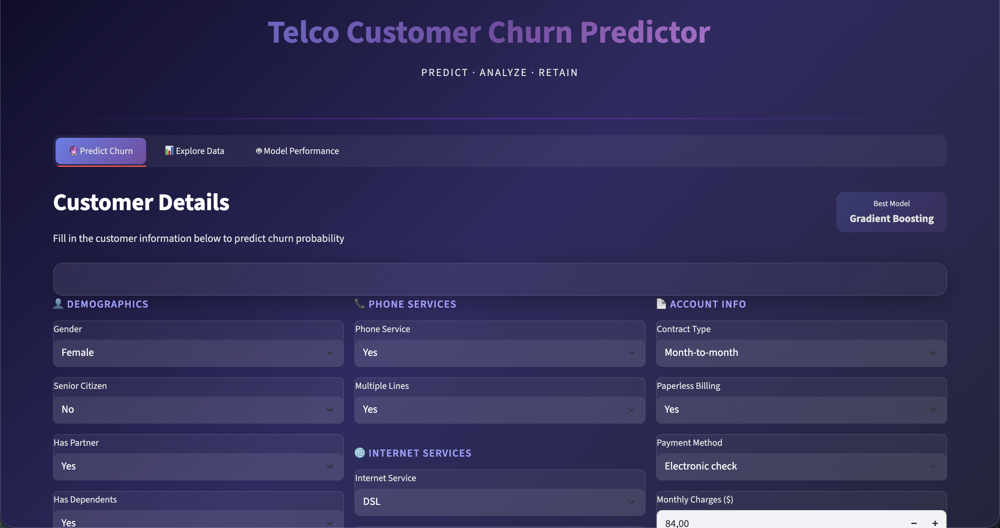
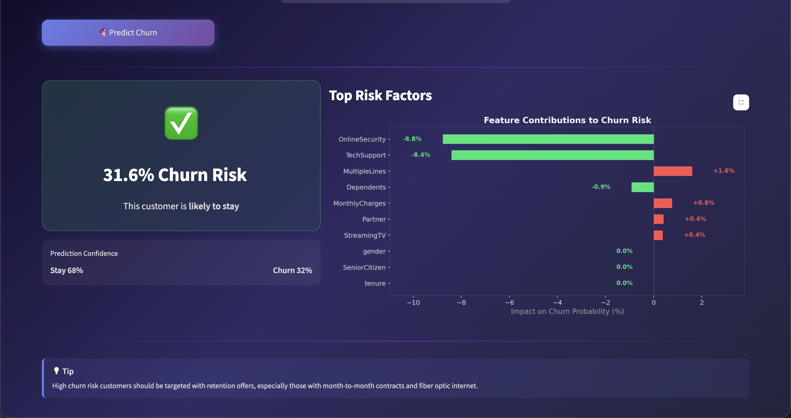
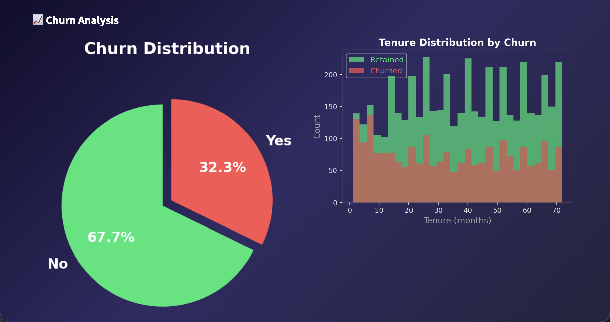
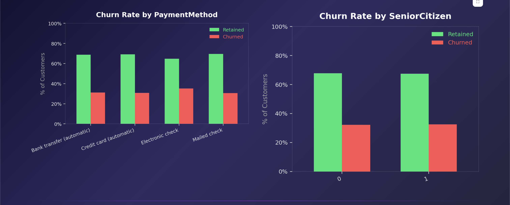
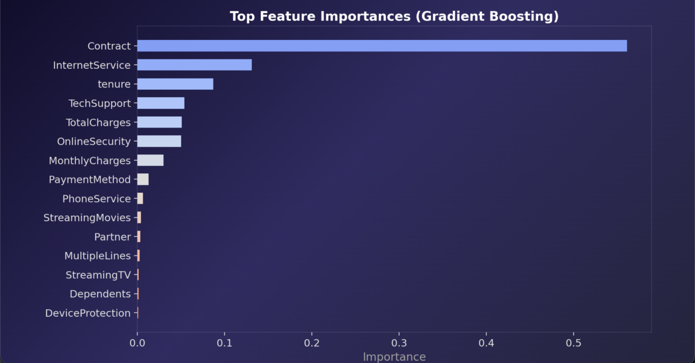
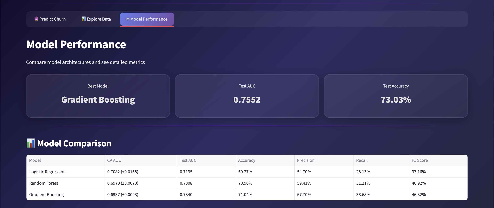

# Telco Customer Churn Predictor

[](https://www.python.org/)
[](https://streamlit.io/)
[](https://scikit-learn.org/)

An interactive machine learning application that predicts customer churn for a telecommunications company. Built with Streamlit, it provides real-time predictions, exploratory data analysis, and model performance metrics.

## Screenshots

| Predict Churn | Prediction Results |
|---|---|
|  |  |

| Data Exploration | Churn Analysis |
|---|---|
|  |  |

| Feature Correlation | Model Performance |
|---|---|
|  |  |

## Features

- **Real-time Churn Prediction** — Enter customer details and get instant churn probability with risk factor analysis
- **Interactive EDA Dashboard** — Explore the dataset with visualizations for churn distribution, feature correlations, and key insights
- **Multi-Model Comparison** — Trains and compares Logistic Regression, Random Forest, Gradient Boosting, and XGBoost
- **Hyperparameter Tuning** — Automatic grid search to find the best model configuration
- **Beautiful UI** — Modern, dark-themed interface with gradient accents and responsive design

## Quick Start

```bash
# Clone the repository
git clone https://github.com/yourusername/telco-churn.git
cd telco-churn

# Install dependencies
pip install -r requirements.txt

# Train the model
python train.py

# Launch the app
streamlit run app.py
```

Open [http://localhost:8501](http://localhost:8501) in your browser.

## Dataset

The dataset contains 7,043 customer records with 19 features:

| Category | Features |
|---|---|
| **Demographics** | Gender, Senior Citizen, Partner, Dependents |
| **Account Info** | Tenure, Contract Type, Paperless Billing, Payment Method, Monthly Charges, Total Charges |
| **Services** | Phone Service, Multiple Lines, Internet Service, Online Security, Online Backup, Device Protection, Tech Support, Streaming TV, Streaming Movies |

Target variable: **Churn** (Yes/No) — ~32% churn rate.

## Model Performance

The pipeline trains and evaluates multiple classifiers:

| Model | CV AUC | Test AUC | Test Accuracy |
|---|---|---|---|
| Gradient Boosting | 0.7285 | **0.7552** | 73.03% |
| Random Forest | 0.6970 | 0.7308 | 70.90% |
| Logistic Regression | 0.7082 | 0.7135 | 69.27% |

The best model is selected automatically and saved as `model.pkl`.

## Project Structure

```
telco-churn/
├── app.py              # Streamlit web application
├── train.py            # Model training pipeline
├── requirements.txt    # Python dependencies
├── model.pkl           # Trained model artifacts
├── telco_churn.csv     # Customer churn dataset
└── README.md           # Project documentation
```

## Tech Stack

- [Streamlit](https://streamlit.io/) — Web framework for the interactive UI
- [scikit-learn](https://scikit-learn.org/) — ML models and preprocessing
- [XGBoost](https://xgboost.readthedocs.io/) — Gradient boosting framework
- [Pandas](https://pandas.pydata.org/) — Data manipulation
- [Matplotlib](https://matplotlib.org/) & [Seaborn](https://seaborn.pydata.org/) — Data visualization

## License

MIT
